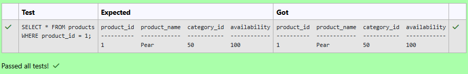
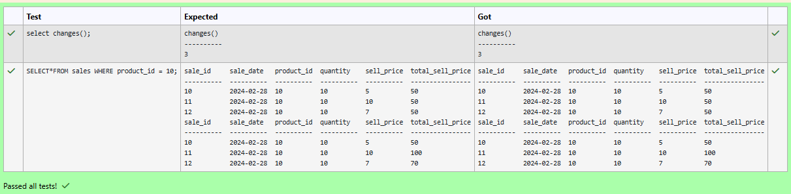
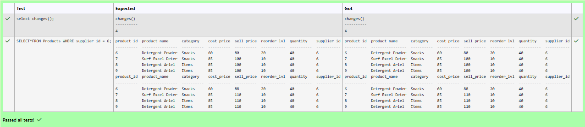
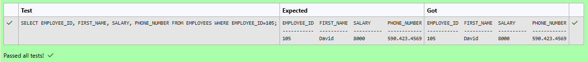
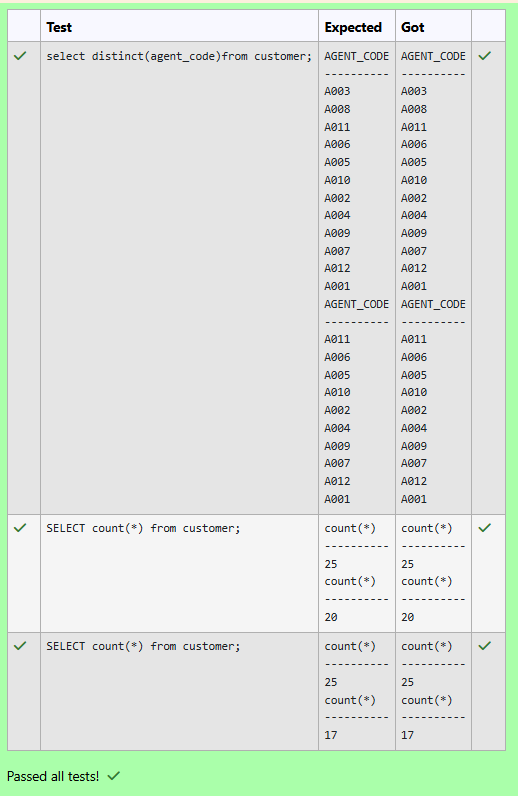
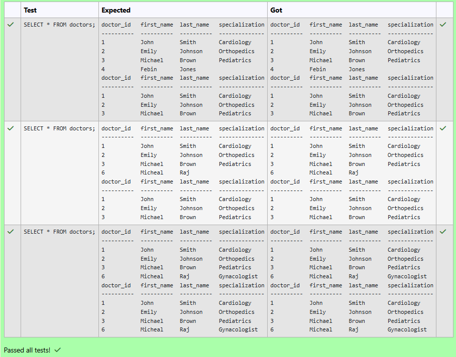
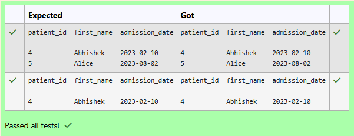
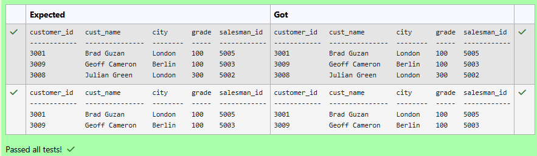
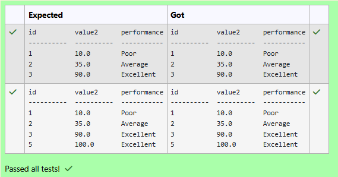
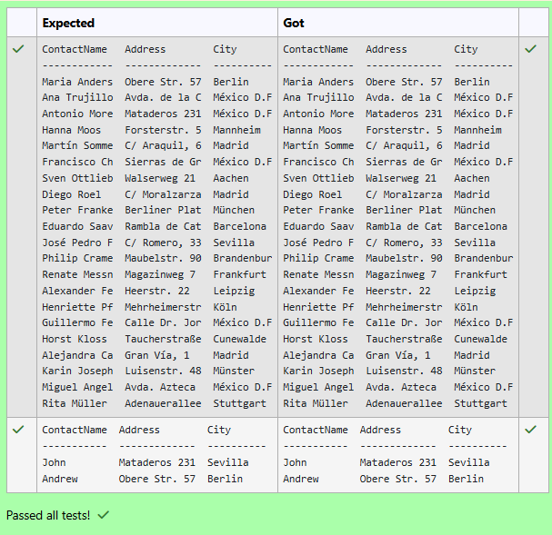

# Experiment 3: DML Commands

## AIM
To study and implement DML (Data Manipulation Language) commands.

## THEORY

### 1. INSERT INTO
Used to add records into a relation.
These are three type of INSERT INTO queries which are as
A)Inserting a single record
**Syntax (Single Row):**
```sql
INSERT INTO table_name (field_1, field_2, ...) VALUES (value_1, value_2, ...);
```
**Syntax (Multiple Rows):**
```sql
INSERT INTO table_name (field_1, field_2, ...) VALUES
(value_1, value_2, ...),
(value_3, value_4, ...);
```
**Syntax (Insert from another table):**
```sql
INSERT INTO table_name SELECT * FROM other_table WHERE condition;
```
### 2. UPDATE
Used to modify records in a relation.
Syntax:
```sql
UPDATE table_name SET column1 = value1, column2 = value2 WHERE condition;
```
### 3. DELETE
Used to delete records from a relation.
**Syntax (All rows):**
```sql
DELETE FROM table_name;
```
**Syntax (Specific condition):**
```sql
DELETE FROM table_name WHERE condition;
```
### 4. SELECT
Used to retrieve records from a table.
**Syntax:**
```sql
SELECT column1, column2 FROM table_name WHERE condition;
```
**Question 1**
--
Write a SQL statement to double the availability of the product with product_id 1.

products table

---------------
product_id
product_name
category_id
availability

```sql
update products set availability=availability*2 where product_id =1;
```

**Output:**



**Question 2**
---
 Update the total selling price to quantity sold multiplied by updated selling price per unit where product id is 10 in the sales table.

SALES TABLE

| Name              | Type             |
|--------------------|------------------|
| sale_id            | INT              |
| sale_date          | DATE             |
| product_id         | INT              |
| quantity           | INT              |
| sell_price         | DECIMAL(10,2)    |
| total_sell_price   | DECIMAL(10,2)    |


```sql
update SALES set total_sell_price=quantity*sell_price where product_id=10
```

**Output:**



**Question 3**
---
Update the 'Selling_Price' to add 10% extra margin for all products supplied by the supplier with id 6.

PRODUCTS TABLE

-- Paste Question 3 here
| Name         | Type           |
|---------------|----------------|
| product_id    | INT            |
| product_name  | VARCHAR(100)   |
| category      | VARCHAR(50)    |
| cost_price    | DECIMAL(10,2)  |
| sell_price    | DECIMAL(10,2)  |
| reorder_lvl   | INT            |
| quantity      | INT            |
| supplier_id   | INT            |


```sql
update PRODUCTS set sell_price=sell_price+sell_price*0.1 where supplier_id=6
```

**Output:**


**Question 4**
---
Write a SQL statement to change salary of employee to 8000 whose Employee ID is 105, if the existing salary is less than 5000.

Employees table

---------------
employee_id
first_name
last_name
email
phone_number
hire_date
job_id
salary
commission_pct
manager_id
department_id

```sql
update Employees set salary=8000 where employee_id=105 and salary<5000;
```

**Output:**



**Question 5**
---
Write a SQL query to Delete customers from 'customer' table where 'AGENT_CODE' is either 'A003' or 'A008'.

Sample table: Customer

```sql
delete from customer where AGENT_CODE='A003'  or  AGENT_CODE='A008';
```

**Output:**



**Question 6**
---
Write a SQL query to Delete All Doctors with a NULL Specialization

Sample table: Doctors
attributes : doctor_id, first_name, last_name, specialization
```sql
delete from Doctors  where Specialization is NULL;
```

**Output:**



**Question 7**
---
Write a SQL query to Select all patients who were admitted during the year 2023.

Table: Patients

```sql
select patient_id,first_name,admission_date from Patients where  admission_date Between "2023-01-01" and "2024-01-01"
```

**Output:**



**Question 8**
---
Write a SQL statement to Find all those customers with all information whose names are ending with the letter 'n'.

customer table

```sql
select * from customer  where cust_name like "%n";
```

**Output:**



**Question 9**
---
Write a SQL query to assess the performance of value2 as 'Poor', 'Average', or 'Excellent' based on whether it is less than 30, between 30 and 70, or greater than 70 in the Calculations table

```sql
SELECT 
    id,
    value2,
    CASE
        WHEN value2 < 30 THEN 'Poor'
        WHEN value2 > 70 THEN 'Excellent'
        ELSE 'Average'
    END AS performance
FROM Calculations;

```

**Output:**



**Question 10**
---
Write a SQL statement to show all the contact_name, address, city of all customers who are from 'Germany', 'Mexico' and 'Spain' countries.

```sql
select contactname, address, city  from customers  where Country in ('Germany','Mexico','Spain')
```

**Output:**



## RESULT
Thus, the SQL queries to implement DML commands have been executed successfully.
