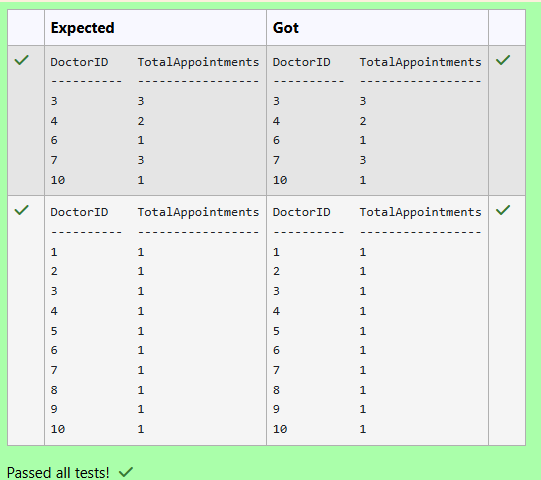
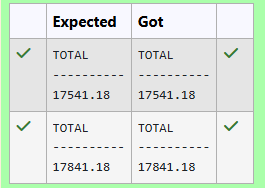
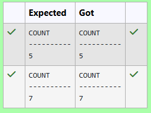
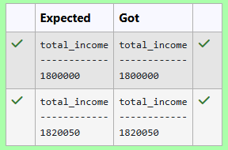
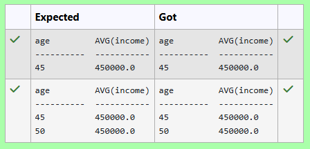
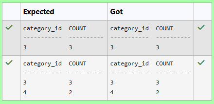
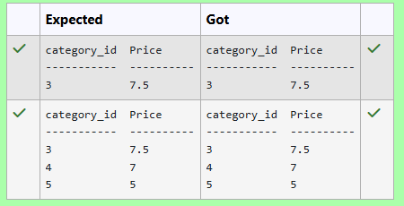
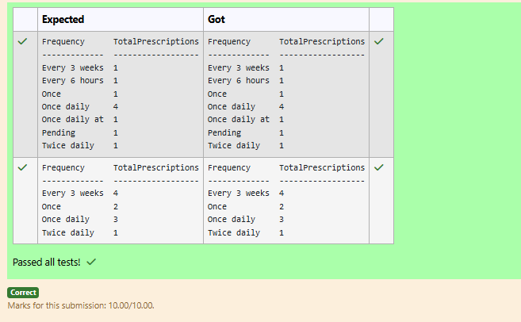

# Experiment 4: Aggregate Functions, Group By and Having Clause

## AIM
To study and implement aggregate functions, GROUP BY, and HAVING clause with suitable examples.

## THEORY

### Aggregate Functions
These perform calculations on a set of values and return a single value.

- **MIN()** – Smallest value  
- **MAX()** – Largest value  
- **COUNT()** – Number of rows  
- **SUM()** – Total of values  
- **AVG()** – Average of values

**Syntax:**
```sql
SELECT AGG_FUNC(column_name) FROM table_name WHERE condition;
```
### GROUP BY
Groups records with the same values in specified columns.
**Syntax:**
```sql
SELECT column_name, AGG_FUNC(column_name)
FROM table_name
GROUP BY column_name;
```
### HAVING
Filters the grouped records based on aggregate conditions.
**Syntax:**
```sql
SELECT column_name, AGG_FUNC(column_name)
FROM table_name
GROUP BY column_name
HAVING condition;
```

**Question 1**
How many appointments are scheduled for each doctor?

Sample table:Appointments Table


```sql
select DoctorID,count(*) as "TotalAppointments" from Appointments  group by DoctorID     
```

**Output:**



**Question 2**
---
How many male and female doctors are there in each medical specialty?

Sample table:Doctors Table

```sql
select Specialty,Gender,count(Specialty) as "TotalDoctors" from Doctors group by Specialty, Gender
```

**Output:**


**Question 3**
---
Write a SQL query to calculate total purchase amount of all orders. Return total purchase amount.

customer table

## Orders Table

| ord_no | purch_amt | ord_date   | customer_id | salesman_id |
|--------|-----------|------------|--------------|--------------|
| 70001  | 150.5     | 2012-10-05 | 3005         | 5002         |
| 70009  | 270.65    | 2012-09-10 | 3001         | 5005         |
| 70002  | 65.26     | 2012-10-05 | 3002         | 5001         |


```sql
select Sum(purch_amt) as "TOTAL" from orders
```

**Output:**



**Question 4**
---
## Table Schema

Write a SQL query to find the number of employees whose age is greater than 32.

## Employee Table

| id | name | age | address    | salary |
|----|------|-----|------------|--------|
| 1  | Paul | 32  | California | 20000  |
| 4  | Mark | 25  | Richtown   | 65000  |
| 5  | David| 27  | Texas      | 85000  |


```sql
select Count(*) as "COUNT" from employee where age>32
```

**Output:**


**Question 5**
---
Write a SQL query to find the total income of employees aged 40 or above.
## Table Schema

| name  | type    |
|-------|---------|
| id    | INTEGER |
| name  | TEXT    |
| age   | INTEGER |
| city  | TEXT    |
| income| INTEGER |


```sql
SELECT 
select SUM(income) as "total_income" from employee where age>=40
```

**Output:**


**Question 6**
---
From the following tables, write a SQL query to find all orders generated by the salespeople who may work for customers whose id is 3007. Return ord_no, purch_amt, ord_date, customer_id, salesman_id.

## Table Schema

| name  | type    |
|-------|---------|
| id    | INTEGER |
| name  | TEXT    |
| city  | TEXT    |
| email | TEXT    |
| phone | INTEGER |


```sql
select name,email,LENGTH(email) as "min_email_length" from customer order by LENGTH(email) ASC LIMIT 1
```

**Output:**


**Question 7**
---
Write the SQL query that accomplishes the grouping of data by age, calculates the average income for each age group, and includes only those age groups where the average income falls between 300,000 and 500,000.

Sample table: employee


```sql
select age,AVG(income) from employee Group by age having avg(income) between 300000 and 500000
```

**Output:**



**Question 8**
---
Write the SQL query that accomplishes the selection of number of products for each category from products table which includes only those products where the category ID is greater than 2.

Sample table: products


```sql
select category_id,count(*) as "COUNT" from products group by category_id having category_id  >2
```

**Output:**



**Question 9**
---
Write the SQL query that accomplishes the selection of product which has lowest price in each category from the "products" table and includes only those products where the minimum price is less than 10.

## Orders Table (Schema)

| name        | type |
|-------------|------|
| ord_no      | int  |
| purch_amt   | real |
| ord_date    | text |
| customer_id | int  |
| salesman_id | int  |


```sql
select category_id,MIN(Price) as "Price" from  products group by category_id having Min(price)<10

```

**Output:**



**Question 10**
---
How many prescriptions were written in each frequency category (e.g., once daily, twice daily)?

Sample table: Prescriptions Table


```sql
SELECT
    Frequency,
    COUNT(*) AS TotalPrescriptions
FROM
    Prescriptions
GROUP BY
    Frequency;
```

**Output:**




## RESULT
Thus, the SQL queries to implement aggregate functions, GROUP BY, and HAVING clause have been executed successfully.
