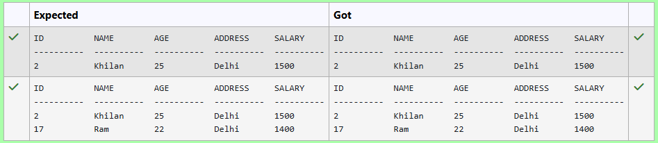
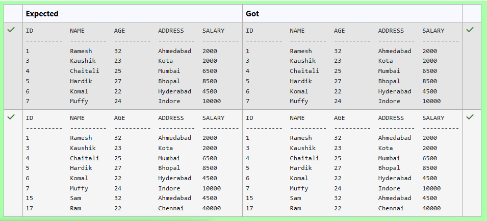
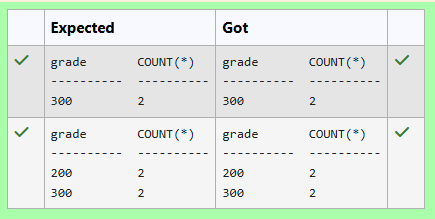
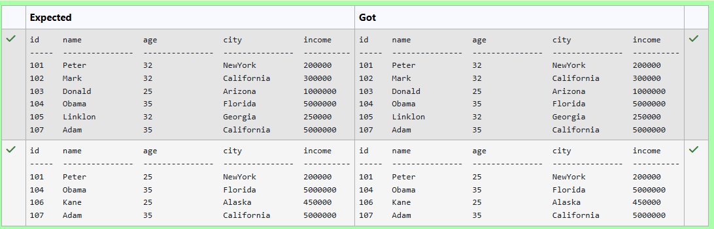
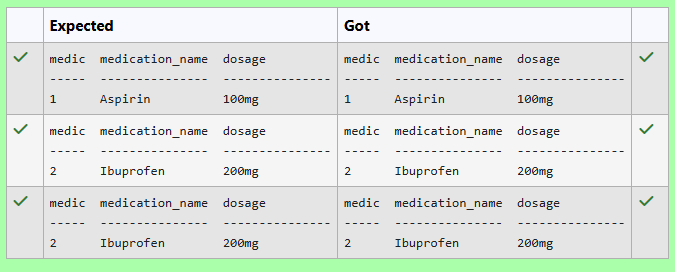
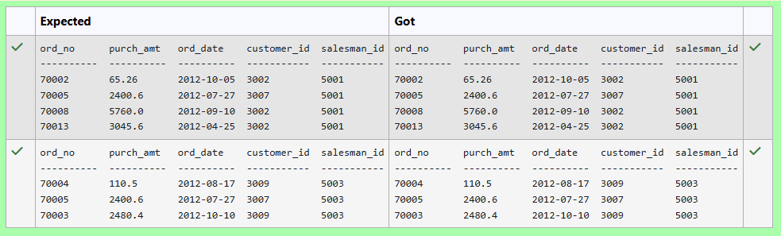
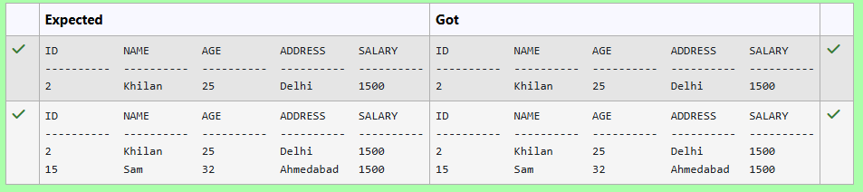
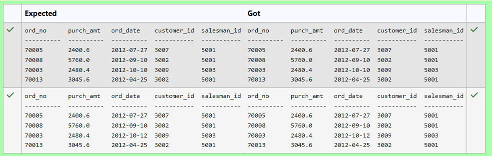
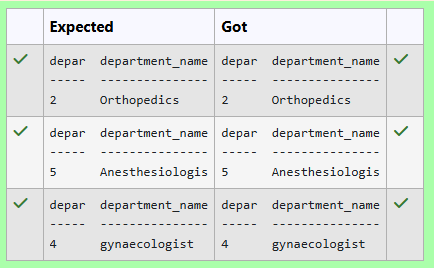

# Experiment 5: Subqueries and Views

## AIM
To study and implement subqueries and views.

## THEORY

### Subqueries
A subquery is a query inside another SQL query and is embedded in:
- WHERE clause
- HAVING clause
- FROM clause

**Types:**
- **Single-row subquery**:
  Sub queries can also return more than one value. Such results should be made use along with the operators in and any.
- **Multiple-row subquery**:
  Here more than one subquery is used. These multiple sub queries are combined by means of ‘and’ & ‘or’ keywords.
- **Correlated subquery**:
  A subquery is evaluated once for the entire parent statement whereas a correlated Sub query is evaluated once per row processed by the parent statement.

**Example:**
```sql
SELECT * FROM employees
WHERE salary > (SELECT AVG(salary) FROM employees);
```
### Views
A view is a virtual table based on the result of an SQL SELECT query.
**Create View:**
```sql
CREATE VIEW view_name AS
SELECT column1, column2 FROM table_name WHERE condition;
```
**Drop View:**
```sql
DROP VIEW view_name;
```

**Question 1**
--Write a SQL query to retrieve all columns from the CUSTOMERS table for customers whose Address as Delhi

Sample table: CUSTOMERS

## Customers Table

| ID | Name     | Age | Address    | Salary |
|----|----------|-----|------------|--------|
| 1  | Ramesh   | 32  | Ahmedabad  | 2000   |
| 2  | Khilan   | 25  | Delhi      | 1500   |
| 3  | Kaushik  | 23  | Kota       | 2000   |
| 4  | Chaitali | 25  | Mumbai     | 6500   |
| 5  | Hardik   | 27  | Bhopal     | 8500   |
| 6  | Komal    | 22  | Hyderabad  | 4500   |
| 7  | Muffy    | 24  | Indore     | 10000  |


```sql
select * from CUSTOMERS where address="Delhi"
```

**Output:**



**Question 2**
---
--Write a SQL query to retrieve all columns from the CUSTOMERS table for customers whose salary is greater than $1500.

Sample table: CUSTOMERS

```sql
select * from CUSTOMERS where salary >1500
```

**Output:**



**Question 3**
---
From the following tables write a SQL query to count the number of customers with grades above the average in New York City. Return grade and count.

customer table

## Customers Table (Schema)

| name         | type |
|--------------|------|
| customer_id  | int  |
| cust_name    | text |
| city         | text |
| grade        | int  |
| salesman_id  | int  |


```sql
SELECT 
    grade,
    COUNT(*)
FROM 
    customer
WHERE 
    grade > (
        SELECT AVG(grade)
        FROM customer
        WHERE city = 'New York'
    )
GROUP BY 
    grade;

```

**Output:**



**Question 4**
---
## Table Schema

Write a SQL query to Find employees who have an age less than the average age of employees with incomes over 2.5 Lakh


| name   | type    |
|--------|---------|
| id     | INTEGER |
| name   | TEXT    |
| age    | INTEGER |
| city   | TEXT    |
| income | INTEGER |


```sql
select * from Employee where age <(select avg(age) from Employee where income >250000);
```

**Output:**


**Question 5**
---
Write a SQL query to Retrieve the medications with dosages equal to the lowest dosage

Table Name: Medications (attributes: medication_id, medication_name, dosage)

```sql
SELECT 
    medication_id AS medic,
    medication_name,
    dosage
FROM 
    Medications
WHERE 
    dosage = (
        SELECT MIN(dosage)
        FROM Medications
    );

```

**Output:**



**Question 6**
---
From the following tables, write a SQL query to find all orders generated by the salespeople who may work for customers whose id is 3007. Return ord_no, purch_amt, ord_date, customer_id, salesman_id.

## Orders Table (Schema)

| name        | type |
|-------------|------|
| order_no    | int  |
| purch_amt   | real |
| order_date  | text |
| customer_id | int  |
| salesman_id | int  |


```sql
select * from orders where salesman_id in (select salesman_id from orders where customer_id=3007)
```

**Output:**



**Question 7**
---
Write a SQL query to retrieve all columns from the CUSTOMERS table for customers whose AGE is LESS than $30

Sample table: CUSTOMERS

## Customers Table

| ID | Name     | Age | Address    | Salary |
|----|----------|-----|------------|--------|
| 1  | Ramesh   | 32  | Ahmedabad  | 2000   |
| 2  | Khilan   | 25  | Delhi      | 1500   |
| 3  | Kaushik  | 23  | Kota       | 2000   |
| 4  | Chaitali | 25  | Mumbai     | 6500   |
| 5  | Hardik   | 27  | Bhopal     | 8500   |
| 6  | Komal    | 22  | Hyderabad  | 4500   |
| 7  | Muffy    | 24  | Indore     | 10000  |


```sql
select * from CUSTOMERS where age<30
```

**Output:**


**Question 8**
---
Write a SQL query to retrieve all columns from the CUSTOMERS table for customers whose salary is EQUAL TO $1500.

Sample table: CUSTOMERS
## Customers Table

| ID | Name     | Age | Address    | Salary |
|----|----------|-----|------------|--------|
| 1  | Ramesh   | 32  | Ahmedabad  | 2000   |
| 2  | Khilan   | 25  | Delhi      | 1500   |
| 3  | Kaushik  | 23  | Kota       | 2000   |
| 4  | Chaitali | 25  | Mumbai     | 6500   |
| 5  | Hardik   | 27  | Bhopal     | 8500   |
| 6  | Komal    | 22  | Hyderabad  | 4500   |
| 7  | Muffy    | 24  | Indore     | 10000  |


```sql
select * from customers where salary=1500
```

**Output:**



**Question 9**
---
From the following tables write a SQL query to find the order values greater than the average order value of 10th October 2012. Return ord_no, purch_amt, ord_date, customer_id, salesman_id.

Note: date should be yyyy-mm-dd format

## Orders Table (Schema)

| name        | type |
|-------------|------|
| ord_no      | int  |
| purch_amt   | real |
| ord_date    | text |
| customer_id | int  |
| salesman_id | int  |


```sql
SELECT ord_no, purch_amt, ord_date, customer_id, salesman_id
FROM ORDERS
WHERE purch_amt > (
    SELECT AVG(purch_amt)
    FROM ORDERS
    WHERE ord_date = '2012-10-10'
);

```

**Output:**



**Question 10**
---
Write a SQL query to List departments with names longer than the average length

Departments Table (attributes: department_id, department_name)

```sql
select department_id as depar,department_name from departments where length(department_name)>(select avg(length(department_name)) from departments)
```

**Output:**




## RESULT
Thus, the SQL queries to implement aggregate functions, GROUP BY, and HAVING clause have been executed successfully.
