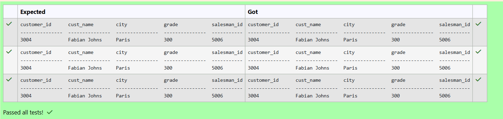
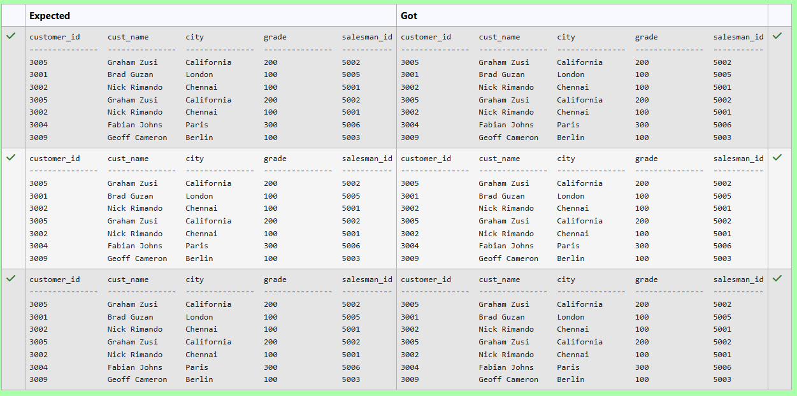
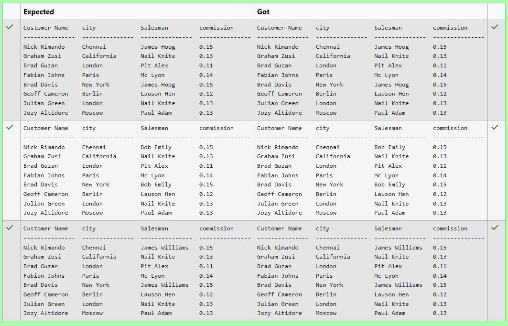
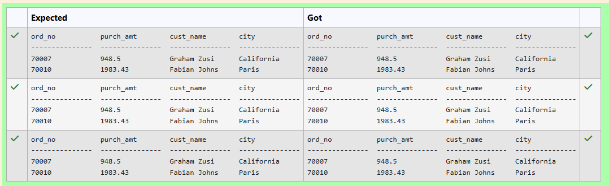
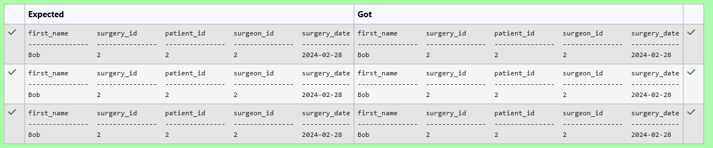
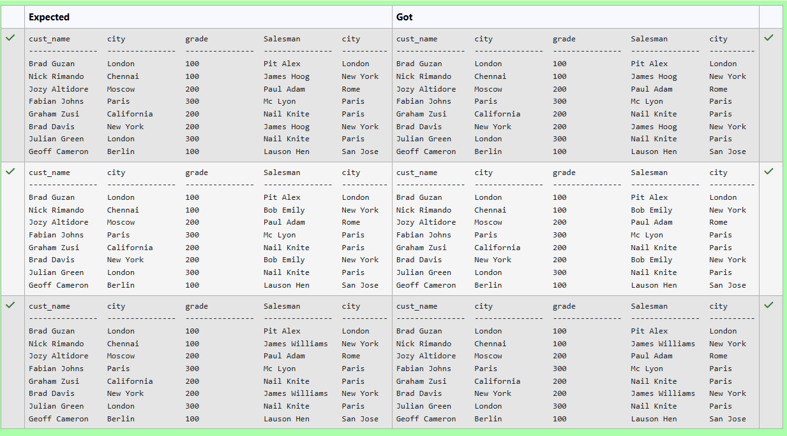
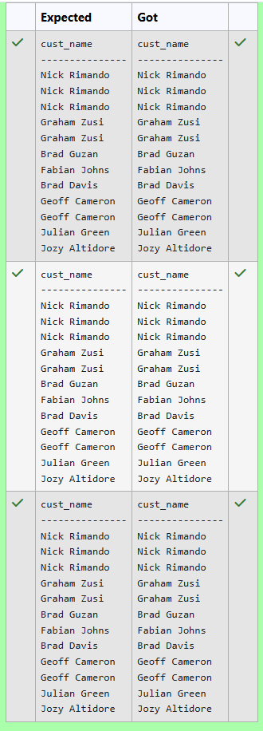
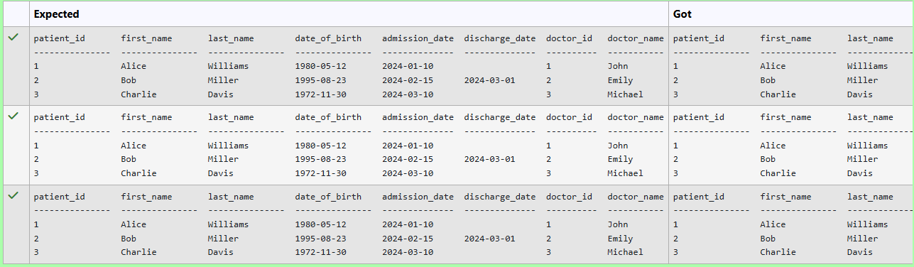
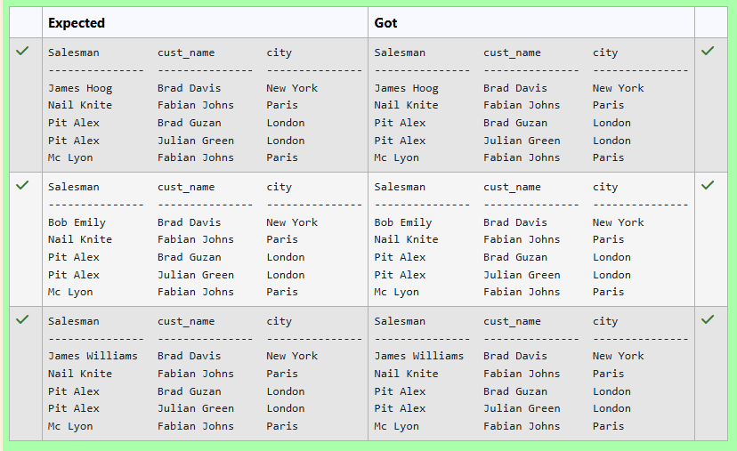
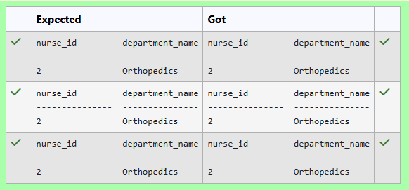

# Experiment 6: Joins

## AIM
To study and implement different types of joins.

## THEORY

SQL Joins are used to combine records from two or more tables based on a related column.

### 1. INNER JOIN
Returns records with matching values in both tables.

**Syntax:**
```sql
SELECT columns
FROM table1
INNER JOIN table2
ON table1.column = table2.column;
```

### 2. LEFT JOIN
Returns all records from the left table, and matched records from the right.

**Syntax:**

```sql
SELECT columns
FROM table1
LEFT JOIN table2
ON table1.column = table2.column;
```
### 3. RIGHT JOIN
Returns all records from the right table, and matched records from the left.

**Syntax:**

```sql
SELECT columns
FROM table1
RIGHT JOIN table2
ON table1.column = table2.column;
```
### 4. FULL OUTER JOIN
Returns all records when there is a match in either left or right table.

**Syntax:**

```sql
SELECT columns
FROM table1
FULL OUTER JOIN table2
ON table1.column = table2.column;
```

**Question 1**
--
Write the SQL query that achieves the selection of all columns from the "customer" table (aliased as "c"), with a left join on the "salesman_id" column and a condition filtering for salesman with the name 'Mc Lyon'.


```sql
select c.* from 
customer c
left join 
salesman s
on c.salesman_id=s.salesman_id
where s.name like "Mc Lyon"
```

**Output:**



**Question 2**
---
Write an SQL query that retrieves all columns from the 'customer' table (using the alias 'c'), performs a LEFT JOIN with the 'orders' table on the 'customer_id' column, and includes only those orders with an order date after '2012-08-17'.

'customer' Table: (customer_id, cust_name, city, grade, salesman_id)

'orders' Table: (ord_no, purch_amt, ord_date, customer_id, salesman_id) 


```sql
SELECT c.*
FROM customer c
LEFT JOIN orders o
    ON c.customer_id = o.customer_id
   AND o.ord_date > '2012-08-17'
WHERE o.ord_no IS NOT NULL;

```

**Output:**



**Question 3**
---
 From the following tables write a SQL query to find salespeople who received commissions of more than 12 percent from the company. Return Customer Name, customer city, Salesman, commission.  

Sample table: customer
## Customer Table

| customer_id | cust_name       | city        | grade | salesman_id |
|-------------|-----------------|-------------|-------|-------------|
| 3002        | Nick Rimando    | New York    | 100   | 5001        |
| 3007        | Brad Davis      | New York    | 200   | 5001        |
| 3005        | Graham Zusi     | California  | 200   | 5002        |
| 3008        | Julian Green    | London      | 300   | 5002        |
| 3004        | Fabian Johnson  | Paris       | 300   | 5006        |
| 3009        | Geoff Cameron   | Berlin      | 100   | 5003        |
| 3003        | Jozy Altidor    | Moscow      | 200   | 5007        |
| 3001        | Brad Guzan      | London      |       | 5005        |

## Salesman Table

| salesman_id | name        | city     | commission |
|-------------|-------------|----------|------------|
| 5001        | James Hoog  | New York | 0.15       |
| 5002        | Nail Knite  | Paris    | 0.13       |
| 5005        | Pit Alex    | London   | 0.11       |
| 5006        | Mc Lyon     | Paris    | 0.14       |
| 5007        | Paul Adam   | Rome     | 0.13       |
| 5003        | Lauson Hen  | San Jose | 0.12       |

```sql
SELECT 
    c.cust_name AS "Customer Name",
    c.city,
    s.name AS Salesman,
    s.commission
FROM 
    customer c
LEFT JOIN
    salesman s
ON
    c.salesman_id = s.salesman_id
WHERE 
    s.commission > 0.12;


```

**Output:**



**Question 4**
---
From the following tables write a SQL query to find those orders where the order amount exists between 500 and 2000. Return ord_no, purch_amt, cust_name, city.
## Customer Table

| customer_id | cust_name       | city        | grade | salesman_id |
|-------------|-----------------|-------------|-------|-------------|
| 3002        | Nick Rimando    | New York    | 100   | 5001        |
| 3007        | Brad Davis      | New York    | 200   | 5001        |
| 3005        | Graham Zusi     | California  | 200   | 5002        |
| 3008        | Julian Green    | London      | 300   | 5002        |
| 3004        | Fabian Johnson  | Paris       | 300   | 5006        |
| 3009        | Geoff Cameron   | Berlin      | 100   | 5003        |
| 3003        | Jozy Altidor    | Moscow      | 200   | 5007        |
| 3001        | Brad Guzan      | London      |       | 5005        |

## Orders Table

| ord_no | purch_amt | ord_date   | customer_id | salesman_id |
|--------|-----------|------------|--------------|--------------|
| 70001  | 150.5     | 2012-10-05 | 3005         | 5002         |
| 70009  | 270.65    | 2012-09-10 | 3001         | 5005         |
| 70002  | 65.26     | 2012-10-05 | 3002         | 5001         |
| 70004  | 110.5     | 2012-08-17 | 3009         | 5003         |
| 70007  | 948.5     | 2012-09-10 | 3005         | 5002         |
| 70005  | 2400.6    | 2012-07-27 | 3007         | 5001         |
| 70008  | 5760      | 2012-09-10 | 3002         | 5001         |
| 70010  | 1983.43   | 2012-10-10 | 3004         | 5006         |
| 70003  | 2480.4    | 2012-10-10 | 3009         | 5003         |
| 70012  | 250.45    | 2012-06-27 | 3008         | 5002         |
| 70011  | 75.29     | 2012-08-17 | 3003         | 5007         |
| 70013  | 3045.6    | 2012-04-25 | 3002         | 5001         |


```sql
SELECT 
    o.ord_no,
    o.purch_amt,
    c.cust_name,
    c.city
FROM 
    orders o
JOIN 
    customer c
ON 
    o.customer_id = c.customer_id
WHERE 
    o.purch_amt >= 500
  AND o.purch_amt <= 2000
ORDER BY 
    o.ord_no;

```

**Output:**



**Question 5**
---
Write the SQL query that achieves the selection of the first name from the "patients" table and all columns from the "surgeries" table, with an inner join on the "patient_id" column. Include conditions to filter for patients discharged between '2024-03-01' and '2024-03-31' but not admitted during the same period.

```sql
SELECT p.first_name, s.*
FROM patients p
INNER JOIN surgeries s
    ON p.patient_id = s.patient_id
WHERE p.discharge_date BETWEEN '2024-03-01' AND '2024-03-31'
  AND (p.admission_date < '2024-03-01' OR p.admission_date > '2024-03-31');

```

**Output:**



**Question 6**
---
From the following tables write a SQL query to display the customer name, customer city, grade, salesman, salesman city. The results should be sorted by ascending customer_id.  

Sample table: customer
## Customer Table

| customer_id | cust_name       | city        | grade | salesman_id |
|-------------|-----------------|-------------|-------|-------------|
| 3002        | Nick Rimando    | New York    | 100   | 5001        |
| 3007        | Brad Davis      | New York    | 200   | 5001        |
| 3005        | Graham Zusi     | California  | 200   | 5002        |
| 3008        | Julian Green    | London      | 300   | 5002        |
| 3004        | Fabian Johnson  | Paris       | 300   | 5006        |
| 3009        | Geoff Cameron   | Berlin      | 100   | 5003        |
| 3003        | Jozy Altidor    | Moscow      | 200   | 5007        |
| 3001        | Brad Guzan      | London      |       | 5005        |

## Salesman Table

| salesman_id | name        | city     | commission |
|-------------|-------------|----------|------------|
| 5001        | James Hoog  | New York | 0.15       |
| 5002        | Nail Knite  | Paris    | 0.13       |
| 5005        | Pit Alex    | London   | 0.11       |
| 5006        | Mc Lyon     | Paris    | 0.14       |
| 5007        | Paul Adam   | Rome     | 0.13       |
| 5003        | Lauson Hen  | San Jose | 0.12       |


```sql
SELECT c.cust_name,c.city,c.grade,s.name as Salesman,s.city
from customer as c
left join 
salesman s on
c.salesman_id=s.salesman_id 
order by c.customer_id 

```

**Output:**



**Question 7**
---
Question text
Write an SQL query to select the 'cust_name' column from the 'customer' table (aliased as 'c'), using a LEFT JOIN with the 'orders' table based on the 'customer_id' column.

'customer' Table: (customer_id, cust_name, city, grade, salesman_id)

'orders' Table: (ord_no, purch_amt, ord_date, customer_id, salesman_id)

```sql
select c.cust_name
from customer c
left join
orders s on
s.customer_id=c.customer_id

```

**Output:**



**Question 8**
---
Write the SQL query that accomplishes the selection of all columns from the "patients" table and the first name of doctors from the "doctors" table, with an inner join on the "doctor_id" column.
## Patients Table (Schema)

| name           | type          |
|----------------|---------------|
| patient_id     | INT           |
| first_name     | VARCHAR(50)   |
| last_name      | VARCHAR(50)   |
| date_of_birth  | DATE          |
| admission_date | DATE          |
| discharge_date | DATE          |
| doctor_id      | INT           |

---

## Doctors Table (Schema)

| name           | type            |
|----------------|------------------|
| doctor_id      | INT             |
| first_name     | VARCHAR(50)     |
| last_name      | VARCHAR(50)     |
| specialization | VARCHAR(100)    |


```sql
select p.*,d.first_name as doctor_name
from doctors d
inner join 
patients p on
p.doctor_id=d.doctor_id
```

**Output:**


**Question 9**
---
## Salesman Table

write a SQL query to find the salesperson and customer who reside in the same city. Return Salesman, cust_name and city.

| salesman_id | name        | city     | commission |
|-------------|-------------|----------|------------|
| 5001        | James Hoog  | New York | 0.15       |
| 5002        | Nail Knite  | Paris    | 0.13       |
| 5005        | Pit Alex    | London   | 0.11       |
| 5006        | Mc Lyon     | Paris    | 0.14       |
| 5007        | Paul Adam   | Rome     | 0.13       |
| 5003        | Lauson Hen  | San Jose | 0.12       |

## Customer Table

| customer_id | cust_name       | city        | grade | salesman_id |
|-------------|-----------------|-------------|-------|-------------|
| 3002        | Nick Rimando    | New York    | 100   | 5001        |
| 3007        | Brad Davis      | New York    | 200   | 5001        |
| 3005        | Graham Zusi     | California  | 200   | 5002        |
| 3008        | Julian Green    | London      | 300   | 5002        |
| 3004        | Fabian Johnson  | Paris       | 300   | 5006        |
| 3009        | Geoff Cameron   | Berlin      | 100   | 5003        |
| 3003        | Jozy Altidor    | Moscow      | 200   | 5007        |
| 3001        | Brad Guzan      | London      |       | 5005        |

```sql
SELECT s.name AS Salesman,
       c.cust_name AS cust_name,
       s.city AS city
FROM salesman s
JOIN customer c
  ON s.city = c.city;

```

**Output:**



**Question 10**
---
-- Write the SQL query that achieves the selection of the "nurse_id" from the "nurses" table (aliased as "n") and the "department_name" from the "departments" table, with an inner join on the "department_id" column and conditions filtering for a nurse with the first name 'David' and last name 'Moore'.

NURSES TABLE:

ATTRIBUTES - nurse_id, first_name, last_name, department_id

DEPARTMENTS TABLE:

ATTRIBUTES - department_id, department_name

```sql
select n.nurse_id,department_name
from nurses n
inner join 
departments d on
n.department_id=d.department_id
where first_name like "%David" and last_name like "%Moore%"
```

**Output:**




## RESULT
Thus, the SQL queries to implement different types of joins have been executed successfully.
